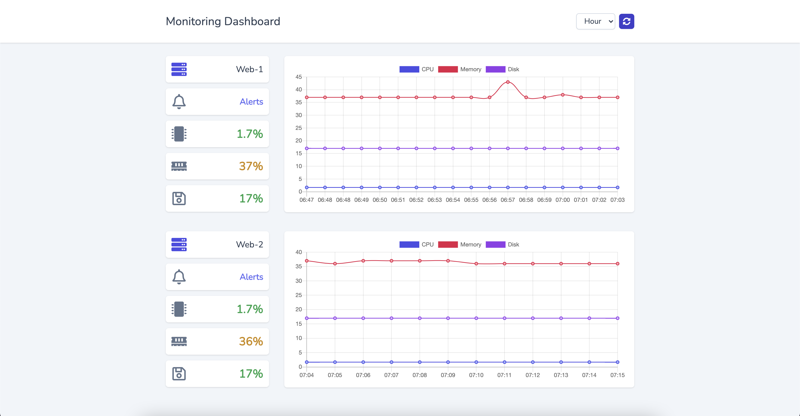

# Laravel Monitoring

[](https://packagist.org/packages/saeedvaziry/laravel-monitoring)


Monitor your Laravel applications server with a beautiful dashboard and get notified if anything gets wrong!




## Supported OS

This package works only on Linux servers.

## Installation

**1)** Install the latest version from composer

```shell
composer require saeedvaziry/laravel-monitoring
```

**2)** Publish vendors

```shell
php artisan vendor:publish --provider="SaeedVaziry\Monitoring\MonitoringServiceProvider"
```

**3)** Run migrations

```shell
php artisan migrate
```

**4)** Set up a cronjob to collect data

```shell
php /path/to/laravel/artisan monitoring:record
```

**5)** Visit `/monitoring` to see the statistics.

## Configuration

You can find the configuration at `config/monitoring.php`.

| Key             | Description                                                                                                                                                                                                                                                                                 |
|-----------------|---------------------------------------------------------------------------------------------------------------------------------------------------------------------------------------------------------------------------------------------------------------------------------------------|
| `instance_name` | This is your current server's name, And the data will be collected under this name.                                                                                                                                                                                                         |
| `routes`        | You can change the URL prefix of the monitoring dashboard. Also, You can protect the route by applying middlewares to it.                                                                                                                                                                   |
| `models`        | If you want to customize the models, define yours and update this config.                                                                                                                                                                                                                   |
| `chart_colors`  | Chart colors are customizable by this config.                                                                                                                                                                                                                                               |
| `notifications` | Currently, we support `Slack` and `Email` channels for notifications. However, You can add your custom channels. To add a custom channel, Create a class and implement it by `SaeedVaziry\Monitoring\Channels\Channel` and then add the class to `channels` under the `notifications` item. |


## Multi-Server support

Sometimes your source code is deployed to multiple servers.

For example, You have multiple webservers with a load balancer and another server for your Backoffice.

In this case, you just need to set a unique name for `MONITORING_INSTANCE_NAME` environment variable on each server, Of course, assuming that you have one database in common with all the servers that you want to monitor.

The result will be similar to the Demo picture.

## Command

You can use `php artisan monitoring:record` command to collect the data manually.

## Facade

Add the bellow line to your `config/app.php` file, Under the `allias`:

```php
'aliases' => [
    ...
    'Monitoring' => \SaeedVaziry\Monitoring\Facades\Monitoring::class
    ...
];
```

With this Facade you can access the server's resource usages.

Example usages:

```php
Monitoring::cpu()->usage(); // returns CPU usage
Monitoring::memory()->usage(); // returns Memory usage
Monitoring::disk()->usage(); // returns Disk usage
```

## Contributing

Please feel free to submit an issue or open a PR.

## Credits

* [Laravel](https://laravel.com/)
* [Vue.js](https://vuejs.org/)
* [Tailwindcss](https://tailwindcss.com/)
* [Fontawesome Icons](https://fontawesome.com/)

## License

Laravel Monitoring is open-sourced software and licensed under the MIT License (MIT).
